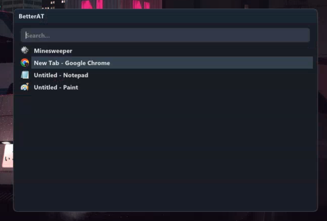
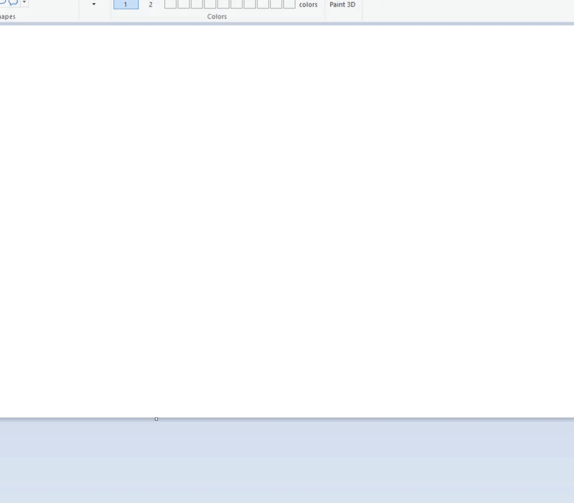

# BetterAltTab

> ⚠️ Under active development — features are subject to change.



BetterAltTab is a lightweight Windows Alt+Tab replacement with:

* **Searchable Window Switcher**
  Press **Shift + B** anywhere to open a searchable list of your open windows.
* **Per‑Window Key Bindings**<br/>
  • Bind any window to `Ctrl + Shift + <key>` by typing `:a<key>` in the overlay<br/>
  • Unbind with `:u<key>`<br/>
* **App Launcher**
  Type `s:<query>` to search Start‑Menu apps (e.g. `s:minecraft`) and launch them directly
* **Tray Icon & Autostart**
  Right‑click the tray icon to toggle “Start on boot” or to Exit

---

## Features

### Window Search & Switch

Type to filter by title, use ↑/↓ or click to switch.

### Bind / Unbind Keys

* **Bind**: `:a<key>` (e.g. `:a#` → binds to Ctrl + Shift + #)
* **Unbind**: `:u<key>`

### App Launcher (`s:`)

Type `s:` + query (e.g. `s:notepad`), navigate, press Enter to launch.

### Tray Integration

* **Autostart**: toggle from tray
* **Exit**: quit from tray

---

## Usage

1. Run `better-altab.exe`
2. Press **Shift + B** to open overlay
3. Start typing to filter windows or enter `s:` mode
4. Bind/unbind with `:a`/`:u` commands
5. Use ↑/↓ and release ```Shift``` to activate or simply click to activate

---

## Screenshots & GIFs

**Bind**<br>


**Unbind**<br>


**App Launcher Demo**<br>


---

## License

This project is released under the [MIT License](LICENSE)  
with the additional [“Commons Clause” License Condition v1.0](LICENSE).

See the full text in [LICENSE](LICENSE).
